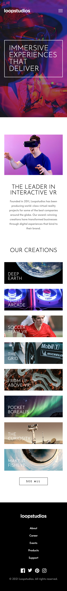
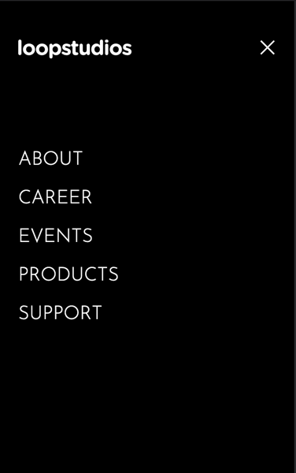

# Frontend Mentor - Loopstudios landing page solution

This is a solution to the [Loopstudios landing page challenge on Frontend Mentor](https://www.frontendmentor.io/challenges/loopstudios-landing-page-N88J5Onjw). Frontend Mentor challenges help you improve your coding skills by building realistic projects.

## Table of contents

- [Overview](#overview)
  - [The challenge](#the-challenge)
  - [Screenshot](#screenshot)
  - [Links](#links)
- [My process](#my-process)
  - [Built with](#built-with)
- [Author](#author)

## Overview

### The challenge

Users should be able to:

- View the optimal layout for the site depending on their device's screen size
- See hover states for all interactive elements on the page

### Screenshot
* Desktop

* Mobile (landing page/menu)

### Links

- Solution URL: [Loopstudios Landing Page using NextJS](https://www.frontendmentor.io/solutions/loopstudios-lading-page-using-nextjs-x_pDGt6D7)
- Live Site URL: [Loopstudios Landing Page](https://loopstudios-landing-page-hanseonglee.vercel.app/)

## My process

### Built with

- Semantic HTML5 markup
- CSS custom properties
- CSS hover animation
- Flexbox
- CSS Grid
- Mobile-first workflow
- [React](https://reactjs.org/) - JS library
- [Next.js](https://nextjs.org/) - React framework
- [Sass/SCSS](https://sass-lang.com/) - For styles

## Author

- Frontend Mentor - [@HanSeongLee](https://www.frontendmentor.io/profile/HanSeongLee)
